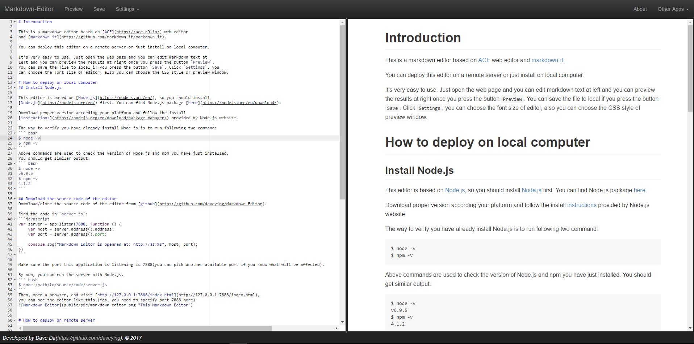

# Introduction

This is a markdown editor based on [ACE](https://ace.c9.io/) web editor 
and [markdown-it](https://github.com/markdown-it/markdown-it).

You can deploy this editor on a remote server or just install on local computer.

It's very easy to use. Just open the web page and you can edit markdown text at 
left and you can preview the results at right once you press the button `PREVIEW`.
You can save the file to local if you press the button `SAVE`.

# How to deploy on local computer
## Install Node.js

This editor is based on [Node.js](https://nodejs.org/en/), so you should install 
[Node.js](https://nodejs.org/en/) first. You can find Node.js package [here](https://nodejs.org/en/download/).

Download proper version according your platform and follow the install 
[instructions](https://nodejs.org/en/download/package-manager/) provided by Node.js website.

The way to verify you have already install Node.js is to run following two command:
``` bash
$ node -v
$ npm -v
```
Above commands are used to check the version of Node.js and npm you have just installed.
You should get similar output.
``` bash
$ node -v
v6.9.5
$ npm -v
4.1.2
```

## Download the source code of the editor
Download/clone the source code of the editor from [github](https://github.com/daveying/Markdown-Editor).

Find the code in `server.js`:
```javascript
var server = app.listen(7888, function () {
    var host = server.address().address;
    var port = server.address().port;

    console.log("Markdown Editor is openned at: http://%s:%s", host, port);
})
```

Make sure the port this application is listening is 7888(you can pick another available port if you know what will be affected).

By now, you can run the server with Node.js.
``` bash
$ node /path/to/source/code/server.js
```
Then, open a browser, and visit [http://127.0.0.1:7888/index.html](http://127.0.0.1:7888/index.html), 
you can see the editor like this.(Yes, you need to specify port 7888 here)



# How to deploy on remote server

You need ssh to your remote server, and do this steps on remote server.

## Install Node.js
First ssh to your remote server, I think this step will not be a problem once you already have a remote server.

And then, it is the same as install on local. You may need to install it via PPA, and you can google it how to install Node.js on remote server.

## Download the source code of the editor

First make sure you have installed `git` on your remote server, so you can clone the source with a simple command line:
```bash
git clone https://github.com/daveying/Markdown-Editor.git
```
You alse need to google it.(note: different OS, different ways)

Find the code in `server.js`:
```javascript
var server = app.listen(7888, function () {
    var host = server.address().address;
    var port = server.address().port;

    console.log("Markdown Editor is openned at: http://%s:%s", host, port);
})
```

Make sure the port this application is listening is 80. Here we choose 80 is because you can visit the app just specify IP address on your broswer. 
And it is much easier to setup a domain name.

By now, you can run the server with Node.js.
``` bash
$ node /path/to/source/code/server.js
```
Then, open a browser, and visit [http://ip_of_your_remote_server](http://ip_of_your_remote_server), you should this editor.

### If you have a domain name
You can add a A record point to ip address of your remote server, and you can using your domain to visit this editor.
(If the port is not set to 80, you should using a tool called [nginx](https://nginx.org/en/))

You already have a domain name, so you can figure out how to setup this.

